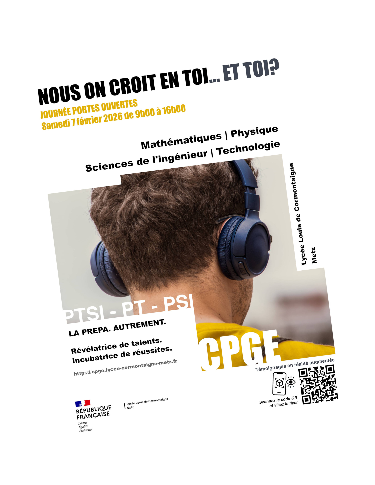

# README

## Projet : Expérience de Réalité Augmentée -- CPGE Lycée Louis de Cormontaigne

Ce projet propose une expérience de réalité augmentée (AR) accessible via un navigateur mobile, permettant d'afficher et de contrôler plusieurs témoignages vidéo lorsque l'utilisateur scanne un flyer dédié.

## Technologies utilisées

### 1. A-Frame (1.6.0)

Framework WebVR/AR pour créer des scènes 3D en HTML.\
Utilisé pour :
- la scène AR
- la caméra
- les plans 3D (a-plane)
- la gestion des assets

CDN :
https://aframe.io/releases/1.6.0/aframe.min.js

### 2. MindAR (mindar-image-aframe) -- v1.2.5

Bibliothèque de réalité augmentée pour la reconnaissance d'images.\
Utilisée pour :
- détecter le flyer
- afficher la vidéo sur la cible
- gérer targetFound / targetLost

CDN :
https://cdn.jsdelivr.net/npm/mind-ar@1.2.5/dist/mindar-image-aframe.prod.js

### 3. HTML5 / CSS3

Utilisés pour :\
- la structure de la page\
- le design des boutons, overlays et modals\
- l'intégration vidéo HTML5

### 4. JavaScript (Vanilla)

Utilisé pour :\
- la gestion du changement de vidéos\
- les événements AR\
- la lecture/pause automatique\
- le modal d'informations\
- la mise à jour des boutons et indicateurs

### 5. Fichiers et assets

-   Vidéos : Temoin1extra.mp4, Temoin2extra.mp4, Temoin3extra.mp4,
    Chat.mp4\
-   Image : Logo-simplifie-NB.jpg\
-   Cible AR : targets-JPO.mind

## Compatibilité mobile

Fonctionne sur Chrome Android, Safari iOS (playsinline), et nécessite un
serveur local ou HTTPS. Testé sur une variété de mobiles (selon les possessions des élèves qui passaient devant le bureau) et de systèmes informatiques.

## Structure du projet

/assets\
/films\
/object\
targets-JPO.mind\
index.html

## Fonctionnement

1.  Scan du flyer.
2.  Détection de la cible et affichage du logo et de la vidéo.
3.  Boutons pour changer de témoignage.
4.  Pause automatique si la cible disparaît.
5.  Modal INFO avec explications + vidéo bonus.

## Crédits

Projet imaginé, encadré et co-développé par Matthieu Farcot\
Avec Alexis Paglierusco et Lucas Munsch (stagiares 1ere Pro CIEL)\
Lycée Louis de Cormontaigne -- Metz, 2025
